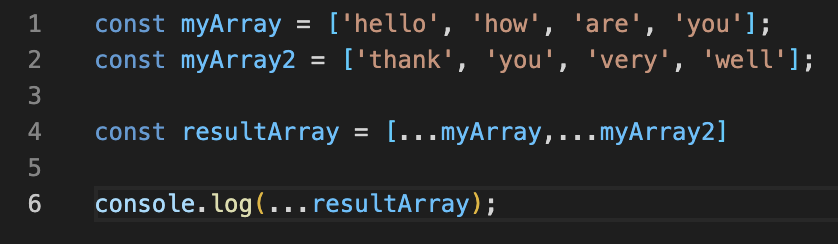
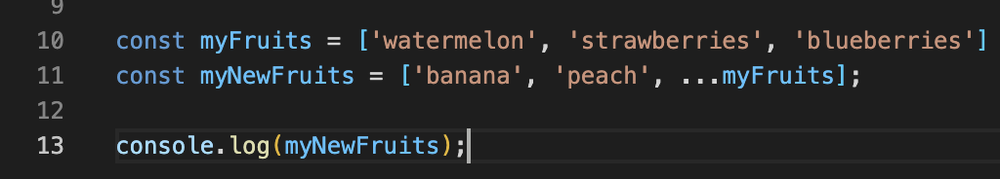
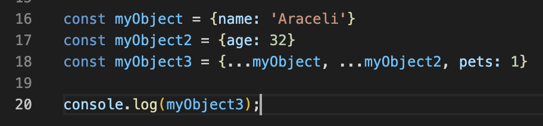

# CLASS 3 READING NOTES

## Passing functions as props 

### React docs: lists and keys.

**1. What does .map() return?**

Always returns a new array, therefore there is no need to declare a new one. It also pushes the result to the new array.

**2. If I want to loop through an array and display each value in JSX, how do I do that in React?**

You would have to use HTML tags inline and curly braces, as displayed in the example below:

**3. Each list item needs a unique...**

Key.

**4. What is the purpose of a key?**

Keys help React identify which items have changed, are added or are removed.

### The spread operator.

**1. What is the spread operator?**

The spread operator is used for adding items to arrays, combining arrays or objects and spreading an array out into a list of arguments. And it's represented with three dots '...'

**2. List 4 things that spread operators can do.**

Spreading the array into separate arguments.
Copying an array.
Concatenating or combining arrays.
Using Math functions.

**3. Give an example of using the spread operator to combine two arrays.**

The result displayed on the console would be the following: *hello how are you thank you very well*

**4. Give an example of using the spread operator to add a new item to an array.**

The result displayed in the console would be the following: *banana, peach, watermelon, strawberries, blueberries*

**5. Give an example of using the spread operator to combine two objects into one.**

The result displayed in the console would be the following: *myObject3 {name: 'Araceli', age: 32, pets: 1}*

## How to pass functions between components.

 **1. In the video, what is the first step that the developer does to pass functions between components?**

We create a function wherever the state we want to change is.

 **2. In your own words, what does the 'increment' function do?**

The 'increment' function loops over the people array and checks if the name matches the name that is passed in. If it does, then it adds the name to the new 'ppl' array.

 **3. How can you pass a method from a parent component into a child component?**

It needs to be passed in as a method in the object located in the parent component. If the function is called 'increment', you would add the following line to the object: *increment={this.increment}*

And once is there it can be passed as props to the child component: *this.props.increment()*

**4. How does the child component invoke a method that was passed to it from a parent component?**

Following the example above, the child component would invoke the method called 'increment' following the next pattern: *this.props.increment().* And in between the parenthesis we would pass in the name of the variable that we want to see modified, which in this case is *this.props.name*.