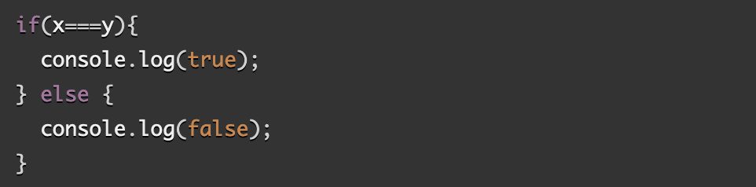

# CLASS 4 READING NOTES

## React and Forms.

### React docs: forms.

**1. What is a 'Controlled Component?**

It is an input form element whose value is controlled by React. This is possible by making the React state be the 'single source of truth'.

**2. Should we wait to store the users responses from the form into state when they submit the form OR should we update the state with their responses as soon as they enter them? Why?**

We should update the state with the responses as they are entered because you can then pass the valur to other UI elements too, or reset it from other event handlers.

**3. How do we target what the user is entering if we have an event handler on an input field?**

### The Conditional (Ternary) Operator.

**1. Why do we use a ternary operator?**

A ternary operator works just like an 'if' statement, which means that a block of code will run only when a certain condition evaluates to true.

**2. Rewrite the following statement using a ternary statement:**

(x===y) ? true : false;